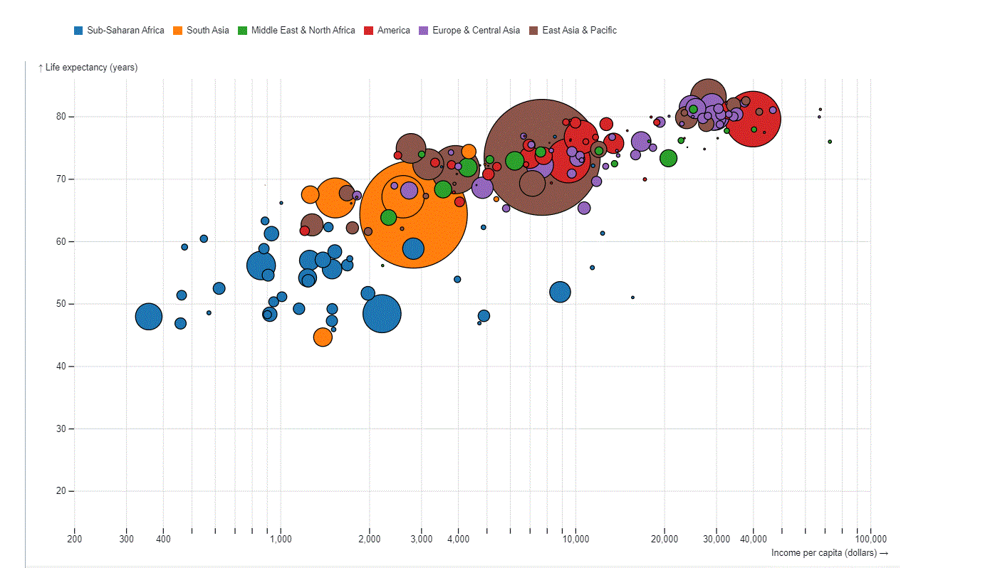
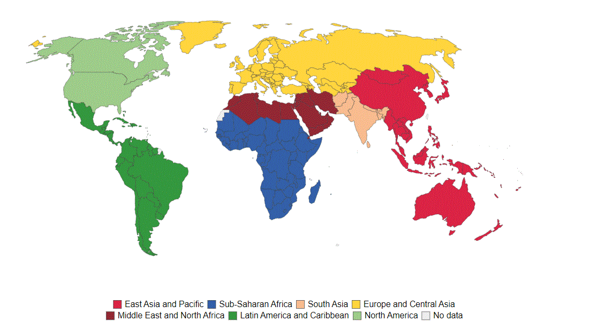
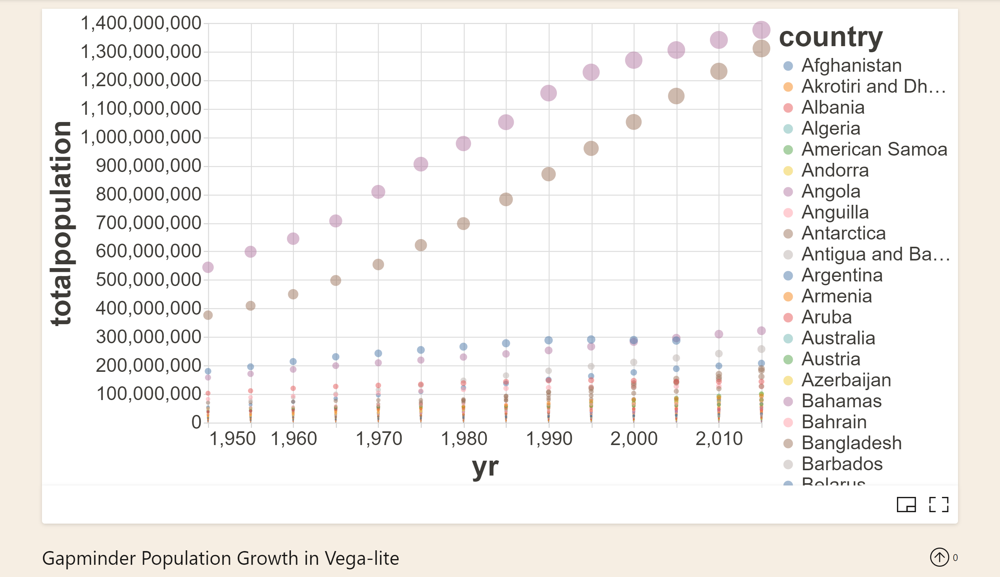
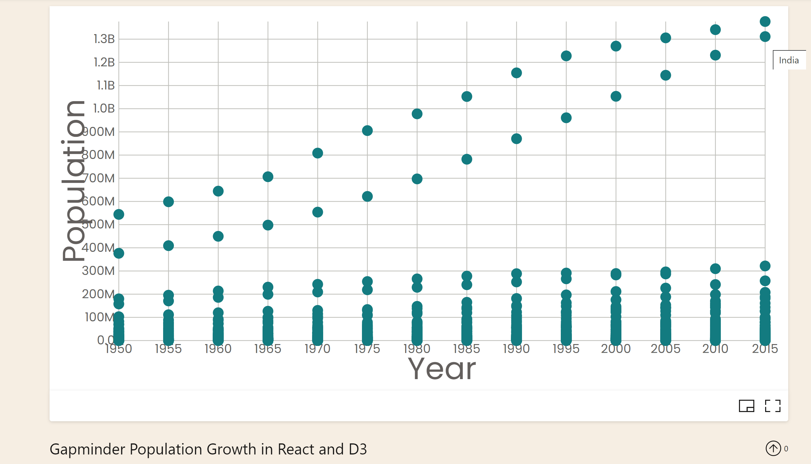
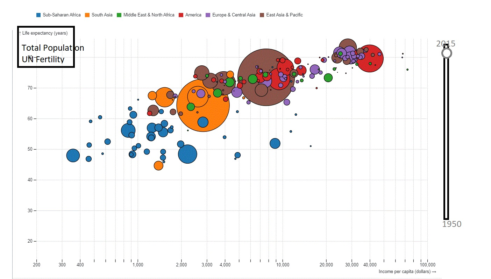
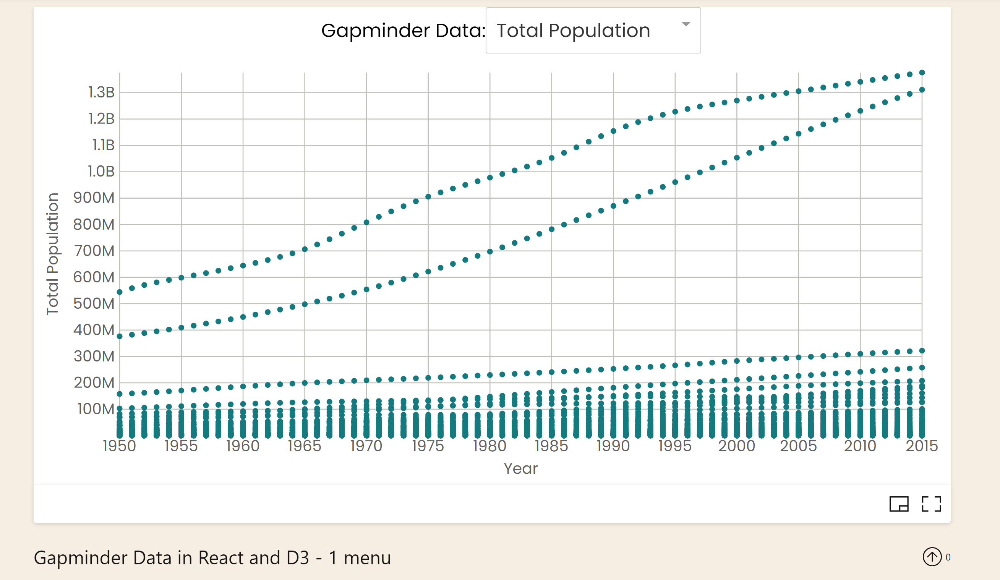
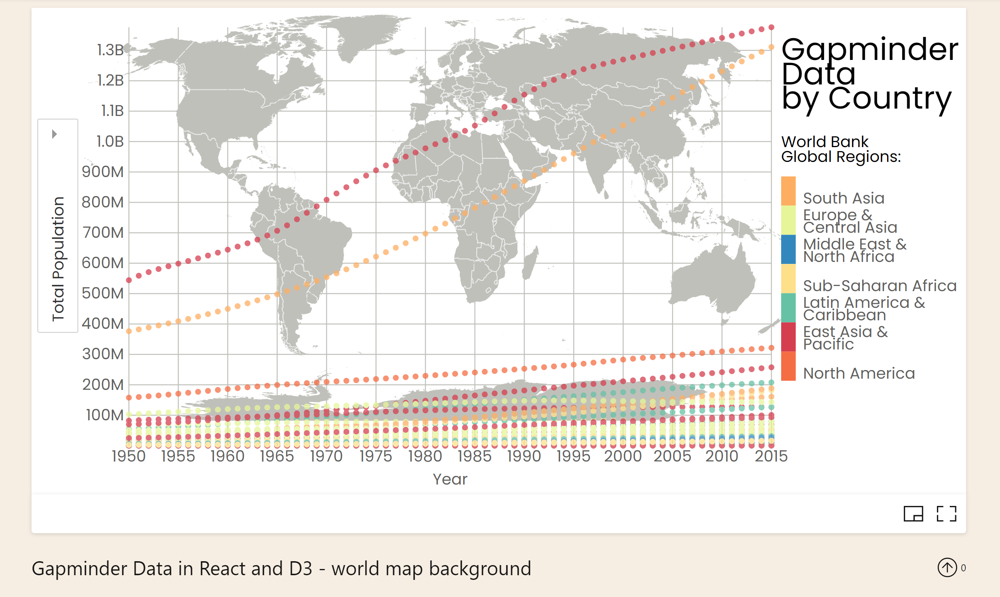
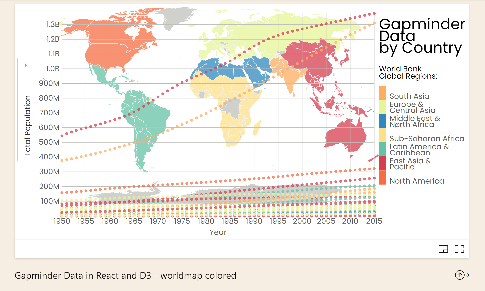
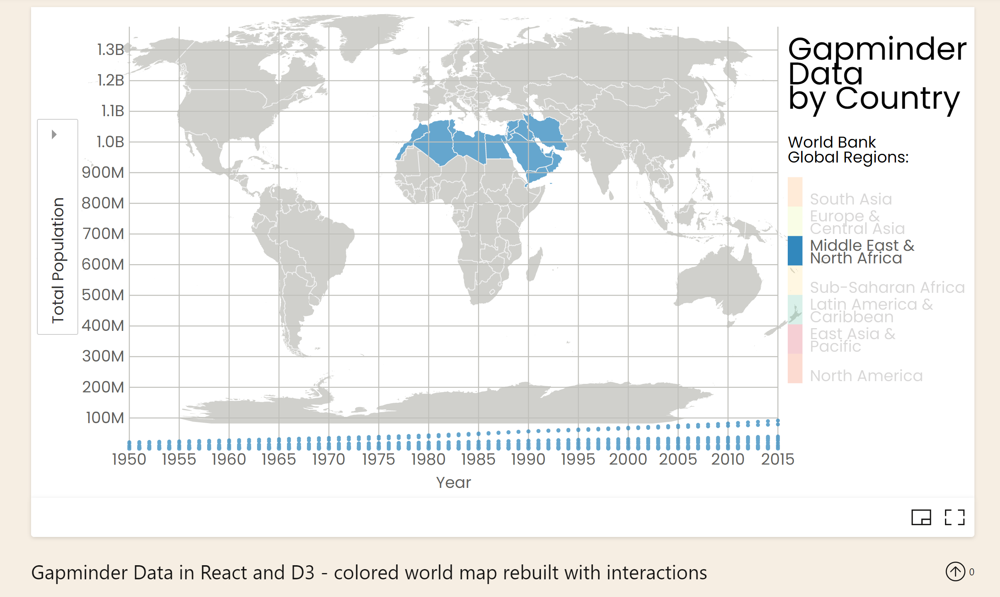
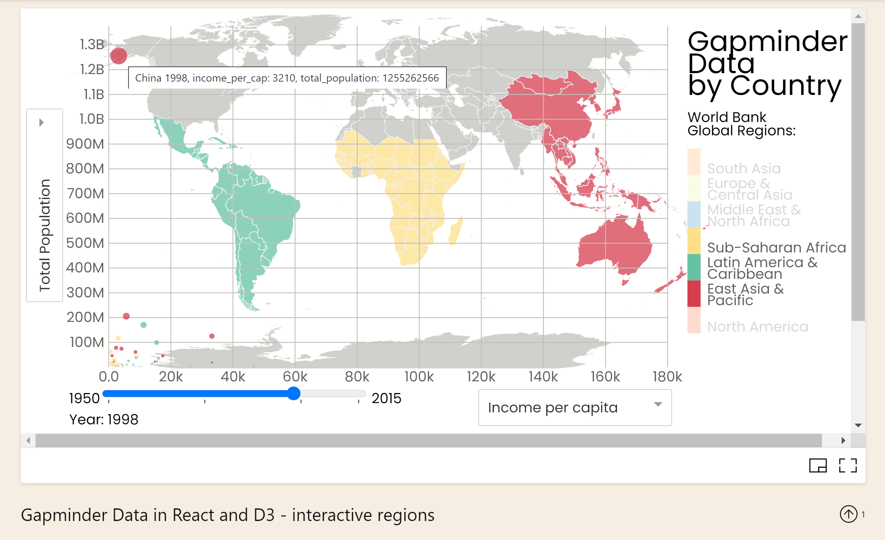

# Data Visualization Project
[YouTube video](https://youtu.be/R31G3uGz8Rs)

## Data

The data I proposed to visualize for my project was the [data](https://gist.github.com/lakalia/ca6cc81792b9d357a20cf2f9fd4c7924) 
behind [Hans Rosling's now famous](https://www.ted.com/talks/hans_rosling_the_best_stats_you_ve_ever_seen#t-718495) Gapminder population growth visualization: 
 

linked to the world regions according to the world bank in the background:

Note: The world regions according to the world bank, to an extent, take cultural similarities into account in addition to geographic location when grouping nations into regions. Thus Mexico is grouped with 'Latin America' instead of 'North America', and 'Northern Africa' is grouped with the 'Middle East' instead of the traditionally accepted but purely geographic region of 'Africa'.

### Questions & Tasks

The following tasks and questions drove the visualization and interaction decisions for this project:

 * Is there a correlation between Population, Life Expectancy, Fertility and a nation's Income per capita over time?
 * Does the world region of a country have any impact on those relationships? How much/what kind?
 * Are there any interesting correlations within or between the world regions?

## Prototypes and Process

I created an initial proof of concept visualization in Vega-Lite of the Hans Rosling Population Growth data over time:

I then began translating that visualization in React and D3:

I used the techniques from [Datavis 2020/CS573](https://www.youtube.com/watch?v=AmOz08_Fh8Q&list=PL9yYRbwpkykuK6LSMLH3bAaPpXaDUXcLV&index=29) to:
* link the world regions in the background
* add drop-downs to change the attributes used to populate the x and y axes
* and add a slider to animate change over time

### Sketches

Hans Rosling's Gapminder data visualization with drop-down for Total Population, Life Expectancy or UN Fertility on the y axis and slider for animation over time:

### Schedule of Deliverables

Wk 6:
* add additional columns to the summary data set:
    - Life Expectancy, UN Fertility and Income per capita for the options for the drop-down(s)
    - region and possibly hex-value for regions and region-color
* add a drop-down to change the attribute used to populate the y axis 

Wk 8:
* add a color legend and the world regions to be faded in the background until a region is "selected" (on mouse-over or by clicking on a region in the legend)
    - selecting a region will make all country-circles in the region and the region in the background pop
    

Wk 10:
* add a slider to animate change over time and add a drop-down for the x-axis to pull in all the attributes
    - any selected region(s) will remain selected when the slider is moved
    - multiple regions can be selected at once for comparison
    - adding the drop-down will allow more investigation, especially into correlations within regions but, not sure if the visualization will become too much
* calculate r for circleRadius based on yValue and y axis range
    - circle size is redundant encoding so not strictly necessary, need to see how cluttered the regions in the background make the overall visualization before deciding whether or not to add

### Open Questions

Although Hans Rosling's visualization on which this project was initially based has been implemented in React and D3 and the code is available on the internet, I wanted to implement this project myself entirely from scratch in order to really learn React and D3. I was concerned the project was too ambitious for the time we had to complete it, but ultimately I did complete it by the end of the class -- it was a great learning exercise and a great way to showcase what I have learned!

## Completed Project

The world regions are faded in the background of the Gapminder visualization until you mouse-over or click on a region in the legend. Mousing over or clicking on a region in the legend highlights that region in the background along with all the graphed datapoints for all the countries that fall in that region. Drop-downs allow the user to choose between visualizing Income per capita, Total Population, Life Expectancy or Fertility on the y axis against Income per capita, Total Population, Life Expectancy, Fertility or Year on the x axis. If Year is chosen on the x axis the user is able to see the path of change over time for any of the other attributes chosen on the y axis and, if Year is not chosen on the x axis, the slider animates change over time just as in the original Hans Rosling visualization. 

### Future Work

* style the slider or import a react component for consistency across browsers
* change the x axis dropdown to dropup and remove scroll bars

